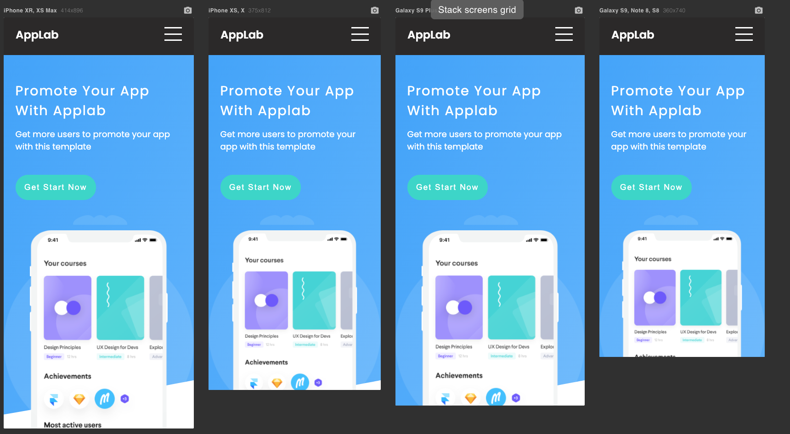
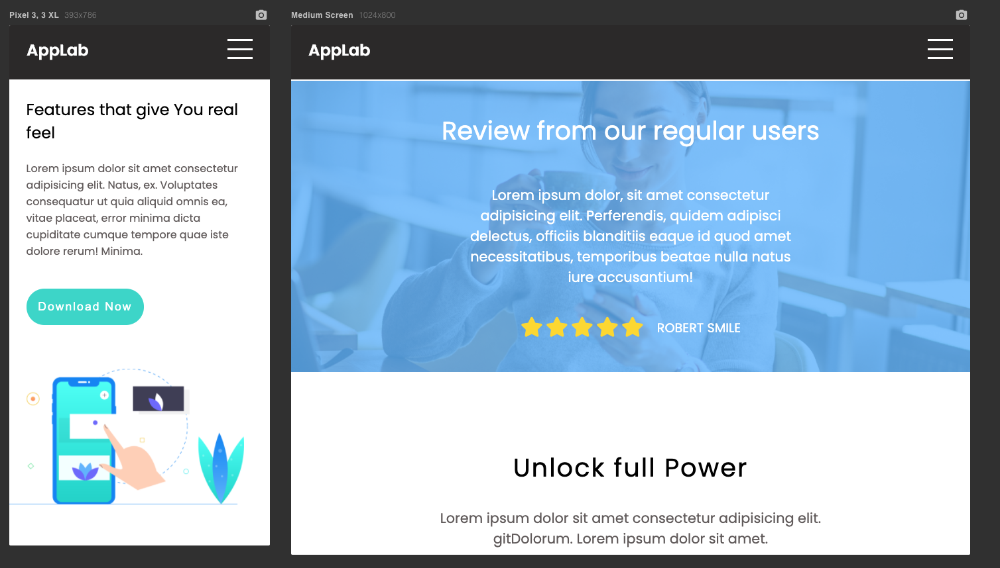
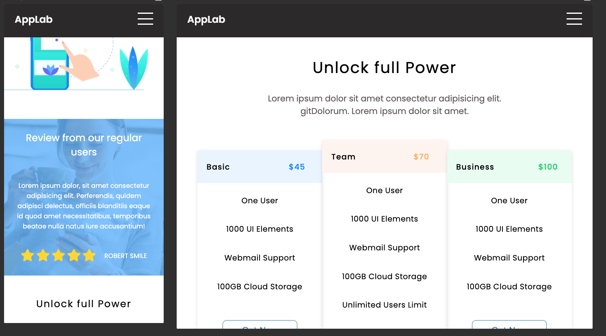
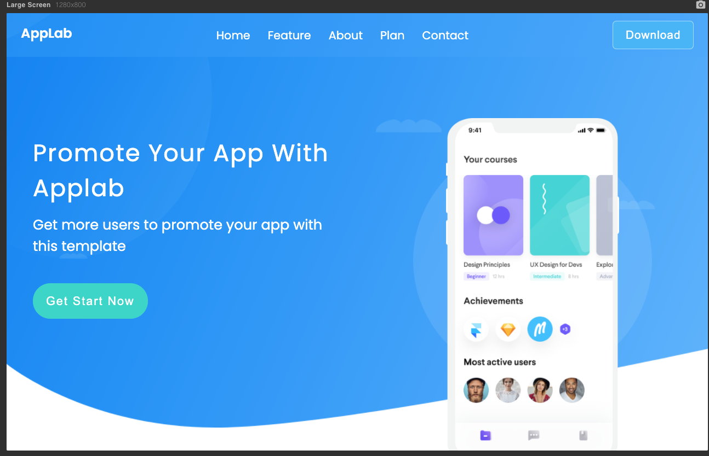

# Project HTML & CSS - RWD

## Table of Contents
1. [About the project](#about-the-project)
2. [Technologies](#technologies)
3. [Links](#links)
4. [Solutions](#solutions)
5. [Project preview](#project-preview)
6. [Contact](#feel-free-to-contact-me)
7. [Thanks](#thanks-for-project-and-support-to-Mateusz-Bogolubow)

## About the project
My second project from scratch - responsive landing page (mobile first). I used HTML and CSS. 
The landing page is based on Colorlib project. I defined 3 breakpoints:
* mobile: max-width: 800px
* tablet: min-width: 801px - 1200px
* desktop: min-width: 1201px

Mobile menu is based on HTML and CSS only

## Technologies:
* HTML5
* CSS3
* BEM
* FLEXBOX
* GRID

## Links
* Live Site URL: [E.Kopacz RWD Project](https://ekopacz-rwd-project.netlify.app)

## Solutions
Creating this project I had an opportunity to practice "how to create mobile first website". 
I prepared different styles for each breakpoint. 
I could learned few new CSS properties like:

* clamp (), min(), max() functions

```
width:clamp(240px, 90%, 600px);
```

* fluid typography

```
--header1:clamp(1.8rem, 5vw, 2.7rem);
--nav-text:clamp(1rem, 4vw, 1.3rem);
--body-text:clamp(1rem, 4vw, 1.3rem);
```

* I got to know rule about "optimal characters per line"

```
.review__text {
    width: clamp(45ch, 50%, 75ch);
}
```

* how to add transparent background images

```
.review::after {
    content: "";
    position: absolute;
    background-color: #5DB2FF;
    opacity: .8;
    top:0;
    left:0;
    width:100%;
    height:100%;
    z-index: -10;
}
```

I created hamburger menu based on the video:
* https://www.youtube.com/watch?v=Al-0vNJD1JU 


### Project preview
Mobile


Mobile and tablet


Mobile and tablet2


Desktop



### Feel free to contact me:
* [Linkedin](https://www.linkedin.com/in/ewelina-kopacz-929559100/)


### Thanks for project and support to Mateusz Bogolubow:
* Mentor i Trener Programowania JavaScript - [DevMentor](https://devmentor.pl/) - Mateusz Bogolubow